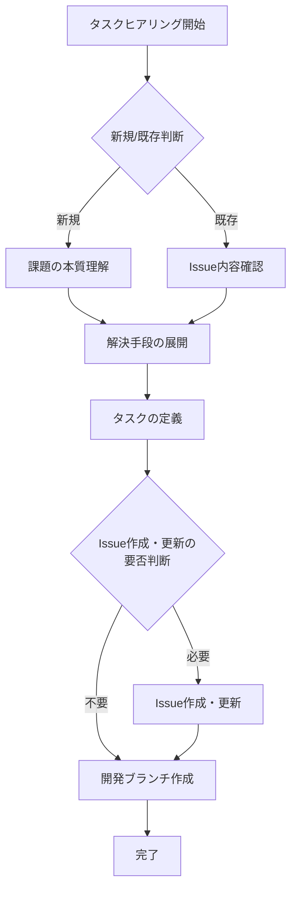

# タスクヒアリングプロセス

## 目的

タスクヒアリングプロセスは、チケット駆動開発の基盤となるプロセスです。このプロセスは、実装作業の開始前に以下の価値を提供します：

1. 要件の明確化

   - 課題の本質を理解し、適切な解決策を選択
   - 誤った方向での実装を防止

2. 品質の確保
   - 変更の影響範囲を事前に把握
   - レビュー基準の明確化と共有

## 制限事項

1. 実装の禁止

   - ヒアリングプロセス中は実装作業を一切行わない
   - 理由：作業ブランチ作成前の実装は混乱を招く原因となる

2. 許可される操作の範囲
   - 要件把握のための既存コードの読み込み
   - 影響範囲の調査のためのファイル確認

## 概要

このプロセスは以下の5つのステップで構成されます：

1. 課題意識の抽出

   - タスクの種類判断（新規/既存）
   - 課題の本質理解
   - 問題点と理想状態の把握

2. 解決手段の展開

   - 解決アプローチの列挙と評価
   - 最適な手段の選択

3. タスクの定義

   - 変更の種類と影響度の決定
   - 実装計画の立案

4. Issueの作成と更新

   - Issue作成・更新の要否を確認
   - 既存Issueの更新または新規Issue作成
   - タスク定義の文書化

5. 開発ブランチの作成
   - GitHub flowに従ったブランチ作成
   - 適切なブランチ名の決定

### プロセスフロー



**完了条件**：
以下の2点が満たされた時点でタスクヒアリングプロセスは完了となります：

1. タスク定義が文章化されていること
2. GitHub flowに従った作業ブランチが作成されていること

## 1. 課題意識の抽出

### 1.0 タスクの種類判断

ヒアリング開始時に、まず以下を確認する：

- 「このタスクは新規の課題でしょうか、それとも既存のIssueに関連する作業でしょうか？」
  - 新規課題の場合：1.1へ進む
  - 既存Issueの場合：
    ```bash
    # 既存Issueの一覧を確認
    gh issue list
    ```
    - Issue一覧表示後、「作業対象となるIssueの番号を指定してください」と確認
    - 指定されたIssue番号を使用して1.2へ進む

### 1.1 新規タスクの場合：課題の本質理解（段階的アプローチ）

#### a) 変更種類の確認

以下の選択肢から、このタスクの種類を選択してください：

- Feature：新機能追加
- Bug Fix：バグ修正
- Test：テスト関連
- Maintenance：メンテナンス
- Performance：性能改善
- Documentation：ドキュメント更新

#### b) 影響度の確認

選択された種類に基づいて、影響度を選択してください：

- Breaking Change：互換性に影響がある変更
  - 例：既存APIの変更
  - 例：依存関係の互換性を破る更新
- Minor Change：機能追加だが互換性は維持
  - 例：新機能の追加
  - 例：既存機能の拡張
- Patch：バグ修正や互換性維持の変更
  - 例：バグ修正
  - 例：ドキュメント更新

#### c) 概要の確認

以下の形式で簡単な概要を教えてください：

```
「[対象]を[どのように]変更することで、[どのような効果]を期待する」
```

例：

- 「ログイン画面を非同期処理に変更することで、UXの向上を期待する」
- 「型定義をより厳密にすることで、開発時のエラー検出を改善する」

#### d) 目的の類推と確認

これまでの情報から、エージェントが本質的な目的を類推し、確認を行います：

1. 変更種類と影響度から基本的な方向性を把握
2. 概要から具体的な改善ポイントを特定
3. それらを統合して本質的な目的を類推
4. ユーザーに類推の正誤を確認

この段階的なアプローチにより：

- ユーザーの心理的ハードルを下げる
- 具体的な選択肢から検討を始められる
- 段階的に課題を明確化できる

### 1.2 既存Issueからの開始の場合

```bash
gh issue view [issue番号]
```

- Issueの内容を確認
- 以下の情報が明確になっているか確認：
  - 課題の背景
  - 現状の問題点
  - 期待される結果
- 情報が不足している場合：
  ```bash
  gh issue comment [issue番号] -b "コメント内容"
  ```
  - 不足している情報を特定
  - 質問や追加情報をIssueにコメント
  - 回答を得てからタスク定義プロセスを継続

## 2. 解決手段の展開

- 考えられる解決アプローチを列挙する
- 各アプローチのメリット・デメリットを評価する
- 最適な解決手段を選択する

## 3. タスクの定義

PRルールに基づいて：

- 変更の種類（Feature/Bug Fix/Test/Maintenance/Performance/Documentation）を決定する
- 影響度（Breaking/Minor/Patch）を評価する
- 具体的な実装計画を立案する

## 4. Issueの作成と更新

まず、Issueの作成・更新が必要か否かの意思決定を行います。
この判断は、新規タスク・既存タスクにかかわらず必要です。

判断基準の例：

- 複数人での作業が予想される
- 長期的な追跡が必要
- 関連タスクが存在する可能性がある
- プロジェクトの履歴として記録する価値がある

### 4.1 既存Issueの確認

```bash
gh issue list
```

- 類似のOpenなIssueが存在するか確認
- 存在する場合は、そのIssueにヒアリング結果を追記

### 4.2 新規Issue作成

```bash
gh issue create
```

- 類似Issueが存在しない場合に新規作成
- 以下の要素を含める：
  - 課題の背景と目的
  - 選択した解決手段
  - 実装計画
  - 変更の種類と影響度

### 4.3 Issueテンプレート

#### 機能追加

```markdown
## 機能要望

### 目的

- どのような課題を解決したいか
- 誰がこの機能を使用するか

### 現状

- 現在の動作や制限
- 問題点

### 期待される結果

- 機能実装後のユーザー体験
- 期待される改善効果

### 技術的な考慮事項（任意）

- パフォーマンスへの影響
- 既存機能との関連
- 開発環境への影響
```

#### バグ報告

```markdown
## バグ報告

### 発生条件

- 発生時の操作手順
- 環境情報（ブラウザ、バージョンなど）

### 現象

- 実際の動作
- エラーメッセージ（ある場合）

### 期待される動作

- 本来どのように動作すべきか

### 影響範囲

- 影響を受ける機能
- 影響を受けるユーザー

### 再現性

- 再現率（毎回 / 時々 / 稀に）
- 再現手順の詳細
```

#### パフォーマンス改善

```markdown
## パフォーマンス改善

### 対象領域

- 改善が必要な機能や処理
- 現在の性能指標

### 課題

- 具体的な性能問題
- 影響を受けるユースケース

### 目標

- 期待される性能指標
- 改善後の具体的な効果

### 測定方法

- 性能測定の手順
- 使用するツールや環境
```

#### ドキュメント更新

```markdown
## ドキュメント更新

### 更新対象

- 更新が必要なドキュメント
- 該当セクション

### 更新理由

- なぜ更新が必要か
- 現在の問題点

### 更新内容

- 追加・変更する情報
- 削除する情報（ある場合）

### 影響範囲

- 関連ドキュメント
- 更新後の確認項目
```

## 5. 開発ブランチの作成

```bash
git switch main
git pull origin main
git switch -c タイプ/issue-番号-目的
```

### ブランチ名の構成

1. タイプ：ヒアリングで特定した変更の種類に基づく

   - `feature/` - 新機能追加
   - `fix/` - バグ修正
   - `test/` - テスト関連
   - `maintain/` - メンテナンス
   - `perf/` - パフォーマンス改善
   - `docs/` - ドキュメント更新

2. Issue番号（関連Issueが存在する場合のみ）：`issue-番号`

   - 関連するIssueが存在する場合は必ずIssue番号を含める
   - 関連するIssueが存在しない場合はIssue番号を含めない
   - 変更の重要度や影響範囲にかかわらず、Issueの存在有無のみで判断する

3. 目的：ヒアリングで抽出した課題の解決方法を短く要約（ケバブケース）

   重要な注意事項：

   - 「改善」「明確化」などの抽象的な表現を避ける
   - 代わりに具体的な動詞を使用する

   例）抽象的な表現とその具体的な代替案：

   - 「改善する」の代わりに：

     - add-xxx（追加する）
     - update-xxx（更新する）
     - extend-xxx（拡張する）
     - optimize-xxx（最適化する）
     - refactor-xxx（リファクタリングする）
     - restructure-xxx（再構築する）

   - 「明確化する」の代わりに：
     - add-xxx-description（説明を追加する）
     - update-xxx-definition（定義を更新する）
     - split-xxx（分割する）
     - separate-xxx（分離する）
     - standardize-xxx（標準化する）

   ブランチ名の例：

   - 悪い例：improve-error-handling
   - 良い例：add-error-retry-logic
   - 悪い例：clarify-module-structure
   - 良い例：separate-core-modules
   - 悪い例：improve-performance
   - 良い例：optimize-render-loop

### ヒアリング結果からブランチ名への変換例

例1: 関連Issueが存在する場合

```
ヒアリング結果：
- 課題：スクロールがスムーズでない
- 解決策：慣性スクロールの実装
- 変更種類：Feature
- 関連Issue：#123が存在
→ ブランチ名：feature/issue-123-add-inertial-scroll
```

例2: 関連Issueが存在する場合

```
ヒアリング結果：
- 課題：長時間使用でメモリ使用量が増加
- 解決策：Tickerの解放処理の修正
- 変更種類：Bug Fix
- 関連Issue：#456が存在
→ ブランチ名：fix/issue-456-cleanup-ticker-refs
```

例3: 関連Issueが存在しない場合

```
ヒアリング結果：
- 課題：ブランチ命名規則の説明を改善
- 解決策：ドキュメントの更新
- 変更種類：Documentation
- 関連Issue：なし
→ ブランチ名：docs/update-branch-naming-rules
```

例4: 関連Issueが存在しない場合

```
ヒアリング結果：
- 課題：テストケースの追加
- 解決策：新しいテストの実装
- 変更種類：Test
- 関連Issue：なし
→ ブランチ名：test/add-scrollbar-tests
```
