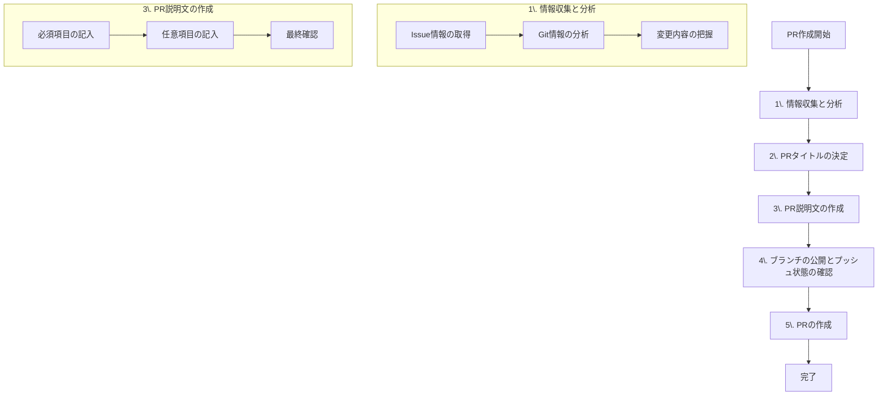

# Pull Request作成の手順書

## 本手順書について

このドキュメントは、Pull Request作成の標準プロセスを定義する手順書です。
実装完了後、このドキュメントの手順にしたがって、順序通りにPull Requestを作成してください。

**重要な注意事項：**

- 各ステップは必ず順番に実行してください
- 手順をスキップしたり、順序を変更したりしないでください
- 次のステップに進む前に、現在のステップが完了していることを確認してください

## システム要件

このドキュメントのすべての手順は、GitHub CLI (gh) の使用を前提としています。
ghコマンドはPull Request作成・管理の基本ツールとして必須です。
ただし、プロジェクトコンテキストで別のGitホスティングサービスの使用が明記されている場合は、
その指示を優先してください。

## Pull Requestの目的

Pull Requestはコミュニティとのコミュニケーションツールであり、以下の2つの主要な目的があります：

1. レビュアーの理解促進

   - 変更の影響範囲を明確に把握できるようにする
   - レビュー時の判断材料を適切に提供する

2. 変更履歴の追跡可能性
   - 後から変更内容とその理由を理解できるようにする
   - システムの進化の過程を記録する
   - エージェントによる自動解析を可能にする
     - 変更パターンの分析
     - コード品質の追跡
     - 依存関係の管理
   - CIシステムによる自動検証を効率化する
     - テスト実行の適正化
     - ビルドプロセスの最適化
     - デプロイ判断の自動化

## 作成手順の概要

以下の5つのステップを順番に実行します：



**重要な注意事項：**

- このプロセスは一連の流れとして設計されており、途中からの開始や手順のスキップはできません
- 各ステップは後続のステップに必要な情報を提供します
- コンテキストが十分だと思われる場合でも、すべての手順を実行する必要があります

## 基本原則

上記の目的を達成するため、以下の原則に従います：

1. コミュニティガイドラインが存在する場合は、それを優先します

   - PR作成前にREADMEを読み、コミュニティガイドラインの有無を確認する
   - コミュニティガイドラインが存在する場合は、それに従う
   - このドキュメントの手順は、コミュニティガイドラインを補完するものとして扱う

2. 1つのPRは1つのIssueを解決することを目的とする

   - 各PRは明確に定義された1つの課題に対応する
   - PRの目的（解決する課題）を最初に明示する
   - 複数のIssueが含まれる場合は、その理由を明確に説明する

3. 変更の種類と影響度を明示する

   ### 変更の種類

   - 機能追加（Feature）
   - バグ修正（Bug Fix）
   - テスト拡充（Test）
   - モジュールメンテナンス（Maintenance）
   - パフォーマンス改善（Performance）
   - ドキュメント更新（Documentation）

   ### 影響度

   - Breaking Change：互換性が損なわれる変更
     - 例：既存APIの削除・仕様変更
     - 例：依存関係の互換性を破る更新
   - Minor Change：互換性が維持される機能の変更・拡充
     - 例：新機能の追加
     - 例：既存機能の拡張
   - Patch：機能と互換性が維持される変更
     - 例：バグ修正
     - 例：ドキュメント更新
     - 例：テストの追加

## 詳細手順

### 1. 情報の収集と分析

この段階は以降のすべての作業の基礎となるため、必ず最初に実行する必要があります。

#### 1.1 Issue情報の取得

ブランチ名にIssue番号が含まれている場合（例：feature/issue-123-add-scroll）：

```bash
# Issue番号を抽出（例：123）
issue_number=$(git branch --show-current | grep -o 'issue-[0-9]\+' | grep -o '[0-9]\+')

# Issue情報を取得
gh issue view $issue_number
```

取得した情報から以下を確認：

- 課題の背景と目的
- 実装方針
- 関連する議論や決定事項

#### 1.2 Git情報の取得と分析

以下のGitコマンドを使用して変更情報を正確に把握します：

```bash
# 現在のブランチ名を確認
git branch --show-current

# mainブランチとの差分を確認（コミット一覧）
git log main...HEAD --pretty=format:"Commit: %H%nSubject: %s%nBody: %b" --name-status

# 詳細な差分を確認
git --no-pager diff main...HEAD
```

これらの情報を使用して：

1. 変更されたファイルの一覧を作成
2. 各ファイルの変更内容を分析
3. コミットメッセージから変更の意図を抽出
4. ブランチ名から作業の目的を推測
5. 変更の種類と影響度を判断

### 2. PRタイトルの決定

前のステップで収集した情報に基づいて、以下の形式でPRタイトルを作成します：

形式：`[種類] [#Issue番号] 目的`

目的の決定方法：

1. Issue情報がある場合：

   - Issueのタイトルと説明から目的を抽出
   - Issue内の議論や決定事項を反映

2. ブランチ名から：

   - 命名規則に従ったブランチ名（例：`feature/issue-123-add-smooth-scroll`）から情報を抽出
   - 目的部分（add-smooth-scroll）を適切な表現に変換

3. コミットメッセージから：
   - 主要なコミットメッセージから目的を抽出
   - 変更の意図を明確に表現

重要な注意事項：

- 「改善」「明確化」などの抽象的な表現を避ける
- 代わりに具体的な動詞を使用する

例）抽象的な表現とその具体的な代替案：

- 「改善する」の代わりに：

  - 追加する（例：○○機能を追加する）
  - 更新する（例：○○の仕様を更新する）
  - 拡張する（例：○○の機能を拡張する）
  - 最適化する（例：○○の処理を最適化する）
  - リファクタリングする（例：○○の実装をリファクタリングする）
  - 再構築する（例：○○の構造を再構築する）

- 「明確化する」の代わりに：
  - 説明を追加する（例：○○の使用方法の説明を追加する）
  - 定義を更新する（例：○○のインターフェイス定義を更新する）
  - 分割する（例：○○の処理を分割する）
  - 分離する（例：○○の責務を分離する）
  - 標準化する（例：○○の実装を標準化する）

具体的なPRタイトルの例：

- 悪い例：

  - `[Feature] [#123] スクロールバーのコードを改善`
    →「改善」は抽象的で、具体的な変更内容が不明確
  - `[Feature] [#123] APIの使用方法を明確化`
    →「明確化」は抽象的で、実際の変更内容が不明確

- 良い例：
  - `[Feature] [#123] スクロールバーにアニメーション機能を追加`
    → 具体的な機能追加の内容が明確
  - `[Feature] [#124] スクロール処理を非同期化してパフォーマンスを最適化`
    → 具体的な変更内容と目的が明確
  - `[Feature] [#125] APIリファレンスにコード例を追加`
    → 具体的なドキュメント更新内容が明確

### 3. PR説明文の作成

収集した情報と決定したタイトルに基づいて、以下の項目を記載します。

#### 必須項目：

- 解決する課題の説明

  - バグ修正の場合：

    - 現状の挙動
    - 期待される挙動
    - 問題が発生する条件
    - 影響を受けるユースケース
    - 影響を受けるバージョン範囲
      - 最初に確認されたバージョン
      - 影響が及ぶ最新のバージョン
    - 回避策（任意）
      - 一時的な対処方法
      - 対処方法の制限事項
    - 関連する可能性のある他のバグ（任意）
      - 類似の症状を持つバグ
      - 同じ原因から派生する可能性のある問題

  - 機能追加の場合：

    - 追加する機能の概要
    - 想定されるユースケース
    - 技術的な考慮事項（任意）
      - 実装上の制約や要件
      - パフォーマンスへの影響
      - セキュリティへの影響
      - 将来的な拡張可能性

  - 性能改善の場合：
    - 改善前の性能指標
    - 改善後の性能指標
    - 測定環境と条件

- 変更の影響度（レビュー過程で再評価される可能性あり）

  - Breaking Change
    - 互換性が損なわれる変更点
    - 移行に必要な対応
  - Minor Change
    - 追加・変更される機能
    - 既存機能への影響
  - Patch
    - 修正内容の詳細
    - 影響を受ける機能

- 実装方法の概要
- 関連するIssueへのリンク（自動リンクされない場合は完全なURLを記載）
- Breaking Changeの場合、移行手順の説明

- テストの変更内容（変更がある場合）

  - 追加されたテスト
    - テストの目的と検証内容
    - 新しいテストケースのリスト
    - テストファイルの変更点（git diffから抽出）
    - テストの追加理由
    - テストが検証する具体的な動作や状態
  - 修正されたテスト
    - 修正の理由
    - 変更前後の動作の違い
    - テストファイルの具体的な変更内容（git diffから抽出）
  - 削除されたテスト
    - 削除の理由
    - 代替となるテストの有無
    - 削除による影響の評価

- 依存モジュールの状態（必須）
  以下の情報はpackage.jsonとpackage-lock.jsonの差分から自動的に抽出します：
  - 変更がない場合：
    - git diffで確認の上「依存モジュールの変更なし」と明記
  - 変更がある場合は以下を記載：
    - 更新されたモジュール
      - バージョン変更の詳細（必須）
        - 更新前後のバージョン（git diffから自動抽出）
        - メジャーバージョン変更がある場合はその影響
      - 影響範囲の評価（必須）
        - モジュールの外部露出の有無
        - プロジェクトの互換性への影響
      - 補足情報（状況に応じて記載）
        - 非推奨化や将来的な変更予定
        - 公開APIへの具体的な影響
        - 既存機能への具体的な影響
        - 型定義への影響
      - 更新の目的（必須）
        - 機能追加の場合：
          - 追加される機能の概要
          - 既存機能との関連性
        - バグ修正の場合：
          - 修正される問題の概要
          - 影響を受ける機能
        - 互換性維持の場合：
          - 更新が必要な理由
          - 既存機能への影響
        - その他の場合：
          - 更新の具体的な理由
    - 新規追加されたモジュール
      - 追加の理由
      - 影響を受ける機能
      - 選定理由と検討した代替案
    - 削除されたモジュール
      - 削除の理由
      - 代替手段の説明
      - 削除による影響範囲

#### 任意項目（状況に応じて）：

- 複数のIssueを含む場合、その理由と関連性
- 特別な注意が必要な実装箇所
- レビュー時の確認ポイント
- 上記の必須項目では説明しきれない補足情報がある場合は、ここに記載する

### 4. ブランチの公開とプッシュ状態の確認

```bash
# PR作成直前に、ローカルの変更をリモートにプッシュ
git push origin <branch-name>
```

プッシュ後、リモートブランチの状態を確認します：

```bash
# リモートブランチの状態を確認
git branch -vv
```

上記コマンドの出力結果を確認してください：

- ブランチ名の横に `[origin/ブランチ名]` の表示がない場合：
  - ブランチがまだリモートにプッシュされていません
  - 上記のプッシュ手順を再度実行してください
- ブランチ名の横に `[origin/ブランチ名]` の表示がある場合：
  - ブランチはすでにリモートにプッシュされています
  - PR作成に進んでください

### 5. PRの作成

手順3で作成したPR説明文を元に、次のghコマンドでPRを作成します：

```bash
# PR作成
gh pr create --title "PRタイトル" --body "PR説明文"

# 作成したPRの確認
gh pr view

# 作成したPRをブラウザーで表示
gh pr view --web
```
